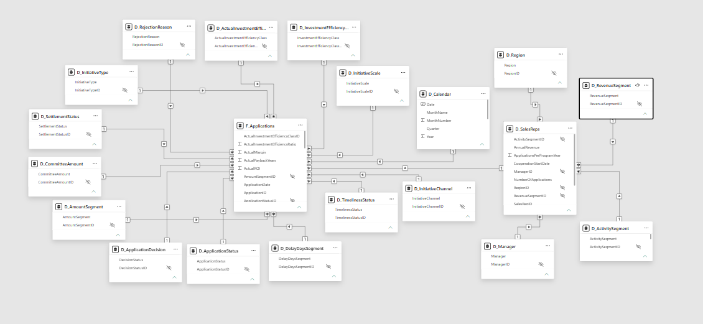
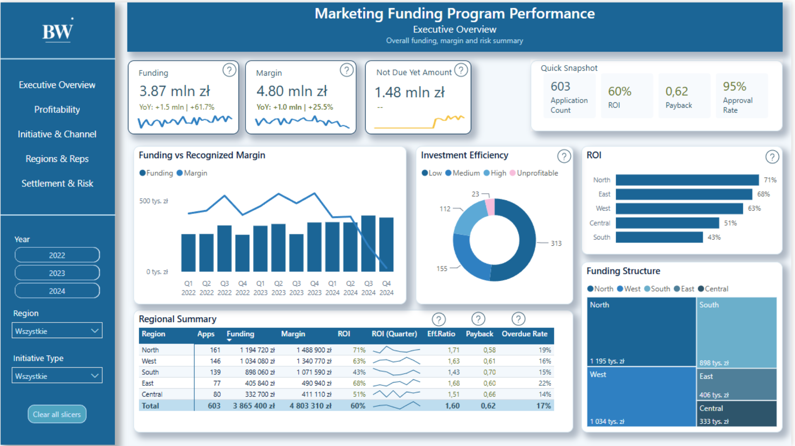
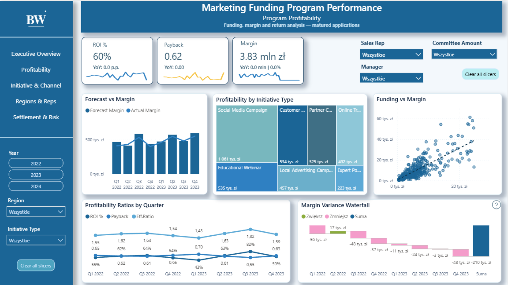
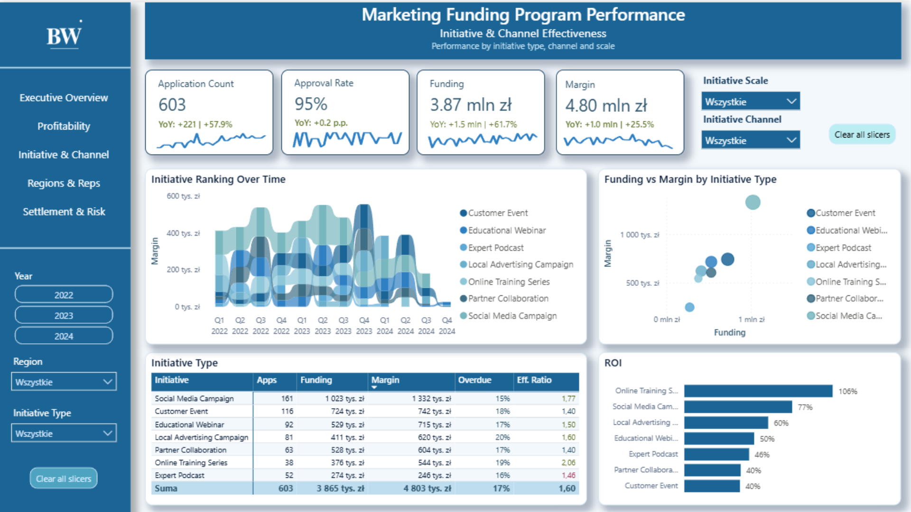
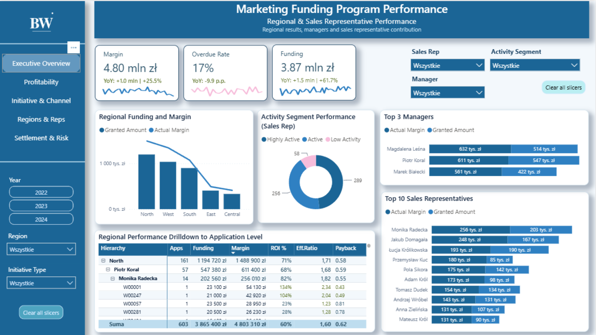
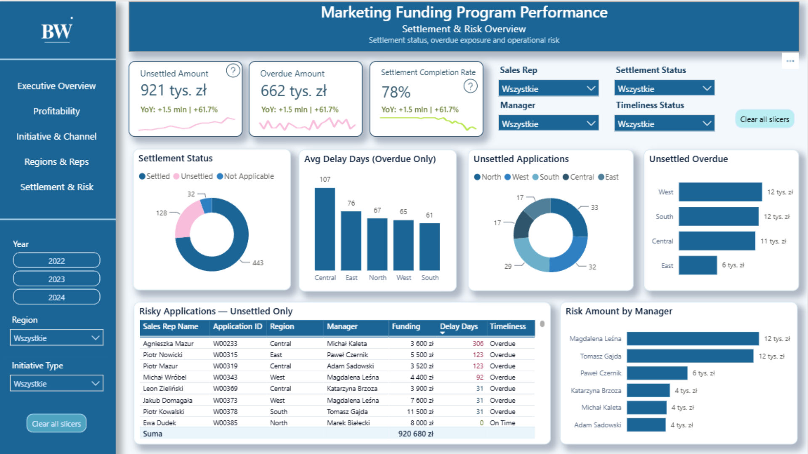

# Marketing Funding Program Performance Analysis

A Power BI interactive report analyzing the performance of a fictional marketing funding program from a management perspective.

The project evaluates granted funding, actual and forecast margin, ROI, payback, investment efficiency, regional performance, initiative effectiveness and settlement-related risk. It extends the operational Excel project by using the same business process in a Power BI management dashboard.

## Project overview

The report was designed for a fictional marketing funding process inspired by a real business scenario. Sales representatives submit applications for marketing funding, the funding is granted or rejected, and approved initiatives are later settled and evaluated based on business results.

This Power BI project focuses on the strategic and managerial perspective. It helps assess whether the funding program generates business value, which initiative types perform best, which regions and sales representatives contribute most to the results, and where settlement risk appears.

The report consists of five analytical pages:

- Executive Overview
- Program Profitability
- Initiative & Channel Effectiveness
- Regional & Sales Representative Performance
- Settlement & Risk Overview

## Tools used

- Power BI
- Power Query
- DAX
- Data model
- ETL process
- Data visualization
- Dashboard design
- Interactive slicers and bookmarks

## Key features

- Interactive Power BI report with five analytical pages
- ETL process prepared in Power Query
- Snowflake-schema data model
- DAX calendar table for time-based analysis
- Management-level KPI overview
- Profitability analysis based on matured applications
- ROI, payback and investment efficiency measures
- Initiative type and channel performance analysis
- Regional and sales representative performance analysis
- Hierarchical analysis from region to application level
- Settlement and overdue risk monitoring
- Interactive filters by year, region, initiative type, sales representative, manager and status
- Help icons and explanatory notes for key business metrics

## Dataset

The dataset was created specifically for this portfolio project. It is fictional and synthetic, inspired by a real business process. Any similarity to real people, values or business situations is coincidental.

The dataset includes:

- marketing funding applications
- requested and granted funding amounts
- forecast margin and actual margin
- application decisions
- settlement statuses
- settlement due dates
- delay days
- sales representatives
- managers
- regions
- initiative types
- initiative channels
- amount segments
- activity segments
- investment efficiency classes

The data was designed to support analysis at several levels:

- overall program level
- region level
- manager level
- sales representative level
- individual application level

## ETL and data preparation

The data preparation process was performed in Power Query using an ETL approach.

The process included:

- importing source tables
- creating staging queries
- cleaning and standardizing column names
- checking and correcting data types
- removing unnecessary technical fields
- merging application data with settlement data
- preparing the fact table
- creating dimension tables
- removing duplicates in dimensions
- adding technical identifiers for selected dimensions
- organizing statuses, segments and efficiency classes
- preparing data for modeling and reporting

The main goal of this stage was to separate data preparation from the analytical layer. The data was first cleaned and structured in Power Query and then used in the data model and DAX measures.

## Data model

The Power BI model was built as a snowflake schema.

The central table is `F_Applications`, where each row represents one funding application. The fact table contains application-level values such as granted funding, forecast margin, actual margin, status information, dates and calculated business indicators.

The model includes dimensions for:

- calendar
- sales representatives
- managers
- regions
- initiative types
- initiative channels
- initiative scale
- application decisions
- application statuses
- settlement statuses
- timeliness statuses
- amount segments
- delay day segments
- revenue segments
- activity segments
- investment efficiency classes
- rejection reasons

The sales representative dimension is connected to additional organizational dimensions such as region, manager, revenue segment and activity segment. This structure makes the model a snowflake schema rather than a simple star schema.



## Report structure

### Executive Overview

The Executive Overview page provides a high-level summary of the program. It shows granted funding, actual margin, applications not yet due for settlement, ROI, payback, approval rate and regional performance.

This page is designed as a management snapshot and helps identify which areas require deeper analysis.



### Program Profitability

The Program Profitability page focuses on funding, margin and return analysis for matured applications.

According to the program assumptions, sales representatives have 12 months after receiving funding to settle the results of the marketing initiative. For this reason, profitability metrics are calculated only for applications whose settlement due date has already passed.

This avoids understating profitability by including applications that are not yet required to be settled.



### Initiative & Channel Effectiveness

The Initiative & Channel Effectiveness page compares the performance of initiative types and channels.

It shows which marketing activities generate the highest margin, how initiative performance changes over time and how funding relates to actual margin across different initiative types.



### Regional & Sales Representative Performance

The Regional & Sales Representative Performance page analyzes results by region, manager and sales representative.

It includes a hierarchical view from region to manager, sales representative and individual application. This allows the user to move from a high-level regional view to detailed application-level analysis.



### Settlement & Risk Overview

The Settlement & Risk Overview page focuses on operational risk related to unsettled and overdue applications.

It shows unsettled amount, overdue amount, settlement completion rate, average overdue days, unsettled applications by region and a list of risky applications requiring further follow-up.



## Measures and business logic

The report uses DAX measures to calculate metrics dynamically based on filters and user selections.

Key measures include:

- Application Count — number of unique applications in the selected context
- Funding — total granted funding amount
- Forecast Margin — total planned margin based on application assumptions
- Actual Margin — total recognized margin from settled initiatives
- ROI — return on investment based on matured applications
- Payback — time needed for funding to be covered by margin
- Eff. Ratio — actual margin divided by granted funding
- Approval Rate — share of approved applications
- Settlement Completion Rate — share of settled approved applications
- Overdue Rate — share of overdue approved applications
- Unsettled Amount — granted funding not yet settled
- Overdue Amount — granted funding related to overdue applications
- Average Delay Days — average delay for overdue applications

ROI, payback and investment efficiency are calculated for matured applications. This means that the measures include applications for which the 12-month settlement period has already passed.

## Interactive report

The interactive report is published outside GitHub.

[Open interactive report](https://TUTAJ-WKLEJ-LINK-DO-RAPORTU-KAJODATASPACE)

If the interactive version is not available, the screenshots in this repository show the report structure and analytical logic.

## Business insights

The report supports several business conclusions:

- The funding program should not be evaluated only by the number of applications or the total amount of granted funding.
- Profitability should be assessed using matured applications, because newer applications may not have had enough time to generate and settle business results.
- Initiative types differ in performance and should not be funded in the same way without additional analysis.
- Some initiatives generate strong margin and favorable return, while others require closer control before further funding is granted.
- Regional results are not uniform, so performance should be reviewed by region, manager and sales representative.
- Settlement risk should be monitored separately from profitability, because a profitable program may still have operational issues related to overdue or unsettled applications.
- Application-level analysis helps identify where high or low performance comes from.

## Recommendations

Based on the analysis, the following business recommendations can be made:

- Continue funding initiative types that generate strong margin and favorable ROI.
- Review or limit funding for initiatives with low efficiency, long payback or weak margin results.
- Monitor unsettled and overdue applications regularly.
- Use settlement status and previous performance history as part of future funding decisions.
- Compare results by region and manager to identify differences in funding effectiveness.
- Separate profitability analysis from settlement risk analysis.
- Use the report as a management tool for budget allocation discussions.
- Treat applications not yet due for settlement as a separate group, not as underperforming applications.

## Relation to the Excel project

This Power BI project is directly related to the earlier Excel project: **Marketing Funding Committee CRM & Dashboard**.

The Excel project focuses on the operational perspective. It supports the committee in reviewing applications, checking sales representative history, updating decisions and monitoring settlement status.

The Power BI project uses the same business process from a different perspective. Instead of supporting the handling of a single application, it evaluates the performance of the entire funding program.

The two projects show how the same business data can support different users and decisions:

- Excel — operational tool for committee work and application-level review
- Power BI — management dashboard for program-level analysis and decision support

Together, they represent a full analytical flow: from operational data handling to management reporting.

## Technical insights

The project demonstrates the following technical skills:

- preparing data with Power Query using an ETL approach
- building a fact table and dimension tables
- designing a snowflake-schema data model
- creating a DAX calendar table
- building DAX measures for KPIs and business indicators
- creating measures that react to filters and slicers
- separating profitability metrics from settlement risk metrics
- designing interactive Power BI report pages
- using hierarchical analysis from region to application level
- creating a clear report structure for business users

## Further development

The project could be extended with:

- automatic data refresh
- additional monthly trend analysis
- a separate variance analysis page
- sales representative segmentation by profitability and settlement behavior
- automated alerts for overdue applications
- integration with an application collection process
- Power Automate-based notifications for settlement follow-up
- additional scenario analysis for future budget allocation

## Repository structure

```text
Marketing-Funding-Program-Performance-Analysis/
│
├── README.md
├── Marketing_Funding_Program_Performance_Analysis.pbix
│
└── screenshots/
    ├── project2_main.png
    ├── project2_data_model.png
    ├── project2_page_1_executive_overview.png
    ├── project2_page_2_program_profitability.png
    ├── project2_page_3_initiative_channel.png
    ├── project2_page_4_regional_sales.png
    └── project2_page_5_settlement_risk.png
```

## Suggested screenshot names

Use the following file names in the `screenshots` folder:

```text
project2_main.png
project2_data_model.png
project2_page_1_executive_overview.png
project2_page_2_program_profitability.png
project2_page_3_initiative_channel.png
project2_page_4_regional_sales.png
project2_page_5_settlement_risk.png
```

## Notes

The report uses synthetic data created for portfolio purposes. It was built to demonstrate business analysis, data preparation in Power Query, data modeling, DAX measures, dashboard design and management reporting in Power BI.
